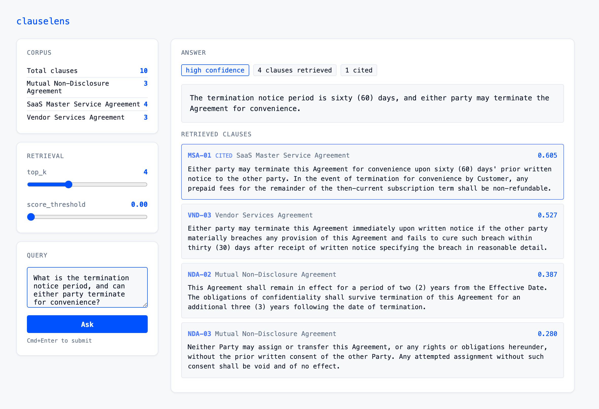

# ClauseLens

Contract clause Q&A with retrieval-augmented generation. Retrieves relevant clauses from a vector store, generates cited answers, and evaluates quality against labeled ground-truth.



*Ask a question → get a **cited** answer with the model's own confidence, plus every retrieved clause and its similarity score. The **CITED** clause is what the answer is grounded in. Citation accuracy and faithfulness are scored separately — a wrong citation and a misstated-but-cited clause are different failures — but that scoring happens in the eval harness, not on the request path. The badge here is the model self-reporting.*

## Architecture

| Component | Implementation |
|-----------|---------------|
| Vector store | SQLite + numpy cosine similarity |
| Embeddings | OpenAI `text-embedding-3-small` |
| Generation | OpenAI `gpt-4o-mini`, structured JSON output |
| API | FastAPI (`POST /ask`, `GET /healthz`) |
| Eval metrics | Citation precision/recall, LLM-as-judge faithfulness |
| Playground | Browser UI at `/` with retrieval parameter controls |

## What it actually scores

Latest committed run ([results/latest.md](results/latest.md) and
[results/retrieval.md](results/retrieval.md), all 10 cases, k=4):

| Metric | Value | Gate |
|--------|-------|------|
| Faithfulness (LLM-judged) | 0.90 | ≥ 0.80 |
| Citation precision / recall | 1.00 / 1.00 | F1 ≥ 0.70 |
| Recall@4 (retrieval only, offline) | 1.00 | ≥ 0.90 |
| Precision@4 (retrieval only) | 0.30 | — |
| MRR | 1.00 | — |

**The caveat that matters more than the numbers:** the corpus is 10 clauses and
`top_k` is 4, so every query retrieves 40% of everything and recall is nearly free.
What these numbers measure is whether the model cites the right clause from a set it
was essentially handed — not whether retrieval works. The one interesting number is
the failure: the committed run judges case 4 (the adversarial NDA-vs-MSA assignment
pair) unfaithful *with perfect citations*, and a rerun of the same case flips it —
see [results/README.md](results/README.md) for why I think the flip is the more
useful finding.

## Project structure

```
clauselens/
  store.py          Vector store (embed, index, search)
  rag.py            Retrieve → generate pipeline
  evals.py          Eval harness and metric computation
  app.py            API and playground server
  static/
    playground.html
data/
  sample_clauses.json
  eval_set.json
tests/
  test_evals.py
```

## Quickstart

No API key needed to see retrieval work — embeddings for the toy corpus are committed:

```bash
pip install -r requirements.txt
python -m clauselens.seed --offline                       # index from the committed cache
python -m clauselens.evals --retrieval-only --split all   # retrieval report, zero API calls
```

For generation (answers, citations, faithfulness) you need a key:

```bash
export OPENAI_API_KEY=sk-...
python -m clauselens.seed --write-cache   # re-embed from the API (and refresh the cache)
uvicorn clauselens.app:app                # playground at http://localhost:8000
python -m clauselens.evals --split dev    # full eval on the dev split
```

## Adding clauses

Clauses live in `data/sample_clauses.json` as an array of objects:

```json
[
  {"id": "NDA-01", "contract": "Acme NDA", "text": "The Receiving Party shall not disclose..."},
  {"id": "MSA-01", "contract": "SaaS MSA",  "text": "Either party may terminate with 30 days..."}
]
```

After editing the file, re-index and verify:

```bash
python -m clauselens.seed      # re-embeds and upserts all clauses
uvicorn clauselens.app:app     # corpus stats visible at http://localhost:8000
```

The playground UI shows the current corpus breakdown (clause count per contract) in the sidebar. If the corpus is empty, it tells you what to do.

## Iteration loop

The workflow for testing retrieval quality as you expand the corpus:

1. Add or modify clauses in `data/sample_clauses.json`
2. Add corresponding Q&A cases in `data/eval_set.json`
3. Re-index: `python -m clauselens.seed`
4. Run evals: `pytest tests/test_evals.py -v`
5. Tune retrieval parameters (`top_k`, `score_threshold`) in the playground
6. Repeat

As the corpus grows, expect citation F1 to drop — that's the signal to improve retrieval (hybrid search, reranking, better thresholds).

## Eval harness

```bash
pytest tests/test_evals.py -v
```

| Metric | Threshold | Description |
|--------|-----------|-------------|
| Faithfulness | >= 0.8 | Every claim supported by retrieved clauses (LLM-as-judge) |
| Citation F1 | >= 0.7 | Cited clause IDs match labeled ground-truth |

## Configuration

| Parameter | Default | Description |
|-----------|---------|-------------|
| `OPENAI_API_KEY` | — | Required |
| `EMBED_MODEL` | `text-embedding-3-small` | Embedding model |
| `CHAT_MODEL` | `gpt-4o-mini` | Generation model |
| `CLAUSELENS_DB` | `clauselens.db` | SQLite database path |

Retrieval parameters (`top_k`, `score_threshold`) are configurable per request via the API or the playground UI.

## Known limitations

- Vector-only retrieval; no BM25 or reranking stage (#4, #5)
- Search is O(corpus) per query — one matmul over a cached, unit-norm matrix. Fine into
  the low thousands of clauses; swap for pgvector well before six figures
- 10-clause corpus at k=4 means retrieval is barely under test (see "What it actually
  scores" above)
- The eval set is 10 cases, all single-hop factual extraction — no multi-hop,
  comparative, or unanswerable cases yet (#7)
- The LLM judge is a single binary vote and measurably flips on borderline cases
  (see results/README.md); no abstain path — the system always tries to answer

## Roadmap

See [open issues](../../issues).
